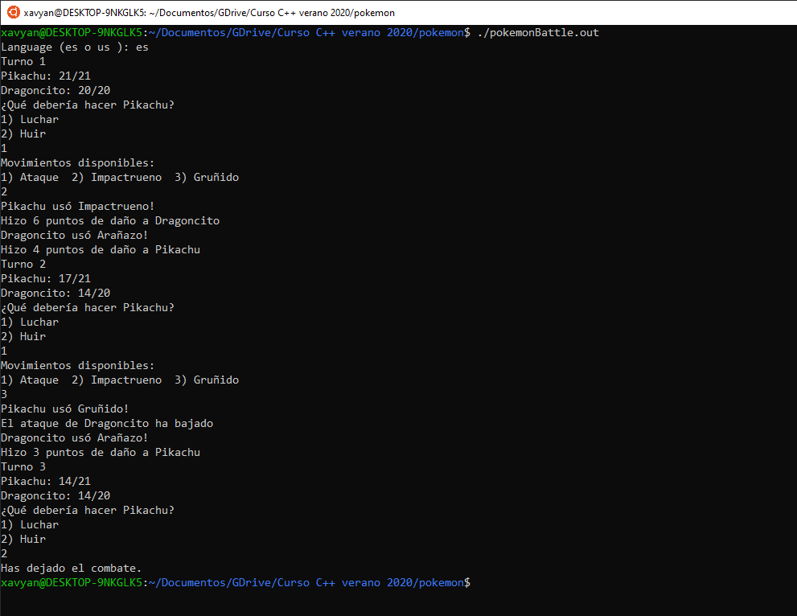
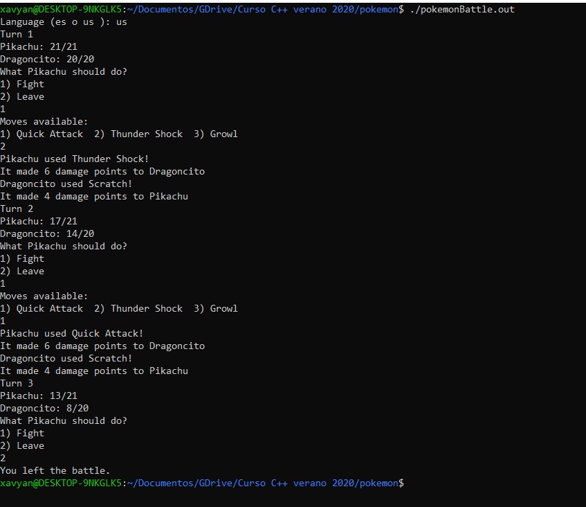

# Pokemon Battle Simulation

This C++ program simulates a simply one vs. one battle pokemon, where you can create easily your own pokemon and moves. Also, it provides spanish and english translations, and a easy way to add your own translations and change it during execution. `main.cpp` executable provides an example that can be compiled and executed to test its functioning.

## How to test yourself.

You may want to try this program in a Linux distributions. I recommend to use `g++` 8.4.0 version or upper, with C++ 17 or upper. Also is recommended to use `make` to compile

To test `main.cpp` program clone this repository and execute `make`. It generates a `pokemonBattle.out` file. Just execute it using `./pokemonBattle.out`.

**NOTE**: You may find warnings when you compile using `make`. Ignore that, the program will work successfully.

## Pictures
Here's some pictures to see it working.

